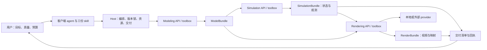

# 建模—模拟—渲染：独立热插拔模块规划书

状态：**总体 v2 设计保留为草案；QQ v1 兼容实现已落地，线上未切换**。日期：2026-09-26。

实施以你的 **1.4.0 模拟器**为真实兼容基线。请先读 [实施方案](implementation-plan.md)、[实现与验收报告](implementation-report.md) 和 [构建使用说明](../../toolboxes/pipeline/README.md)。本目录原有的通用异步 v2 API/schema/example 仍是拟议接口；当前运行接口及三份 skill 位于 `toolboxes/pipeline/`，不能混用。线上仍使用原来的 1.4.2，没有改变活动注册表、调用付费生成服务或发送 QQ 消息。

## 1. 目标与关键决策

让客户端能力较弱的 agent 通过少量结构化调用，完成“描述需求 → 建模 → 模拟 → 渲染 → 视频与数据交付”。它负责理解需求、选择已公布的能力和解释结果；几何生成、参数规范化、任务恢复、质量检查、文件管理交给确定性工具。

最终交付默认同时包含可播放视频和可复核的数据包；用户可以独立选择高精建模、严格数值分析和深度渲染。建模与渲染分别成为独立 toolbox，模拟模块保留已有求解器，三者均可按版本安装、启用、停用、替换和回滚。

确定以下设计：

1. 三个模块、三个 API 命名空间、三份 skill；host 提供一个确定性 pipeline 编排入口。
2. 模块之间传不可变的 `ModelBundle/1 → SimulationBundle/1 → RenderBundle/1`，弱 agent 只传引用，不复制大量网格、逐帧数据或本地路径。
3. `modeling=standard|high`、`simulation=visual|strict`、`rendering=preview|standard|deep` 独立选择。没有统一的“high 就全都精确”开关。
4. 同一份模拟结果可以反复换镜头、材质、渲染器；渲染失败保留数据，渲染不得修改 canonical 数值结果。
5. 高质量渲染的状态需求在模拟前协商；只有抽样视频帧的旧结果不能冒充完整高精轨迹。
6. 外接 API 经 provider adapter 接入；保真几何渲染与生成式风格化分开声明。生成式视频不能作为物理测量证据。
7. v2 是新协议分支。升级 host 的多产物交付后，仍保留 v1 的单 MP4 验证与调用入口。

## 2. 当前代码基线及缺口

下表记录实施前缺口，不代表它们现在仍全部未实现。最新状态见实现报告。最初审计针对工作区；后续兼容验收已使用本机保存的真实 1.4.0 immutable snapshot，而非将 1.4.2 改名为 1.4.0。工作区已有其他未提交修改。

| 层 | 已有能力与依据 | 本次规划需要补齐 |
| --- | --- | --- |
| 建模 API | [api.py](../../physics_demo/api.py)：`physics_system`、`physics_mesh`、`physics_patch`；[core/meshes.py](../../physics_demo/core/meshes.py)：recipe/raw 三角网格与几何审计 | 独立模型引用、参数模板、来源/单位、物理与显示双资产、误差驱动细化；目前无自动图片重建或完整 CAD |
| 模拟 API | [runner.py](../../physics_demo/runner.py) 的 prepare/simulate/query；PCB 由 [pcb_thermal.py](../../toolboxes/physics/pcb_thermal.py) 独立求解 | 公共无视频模拟入口、类型化 SimulationBundle、按需导出状态，不把求解成功绑定视频成功 |
| 渲染 | [io/video.py](../../physics_demo/io/video.py) 已可由保存结果编码、重编码与慢动作；PCB 有 [pcb_video.py](../../toolboxes/physics/pcb_video.py) | 独立 rendering API/toolbox；跨后端 render scene；本地/远端 provider；独立预估和恢复 |
| 数值数据 | 结果、诊断、预声明 observations/queries 已保存在任务目录；部分回复有 `data_summary/data_answers` | 正式 JSON/CSV/状态文件交付及数据字典，文件回执、保留期限、完整性检查 |
| 热插拔 | [registry.py](../../toolboxes/registry.py) 有内容摘要快照和原子 `active.json`；host 持久保存任务 pin | 当前一个 active 和单模块 pin；需要三模块组合的原子选择、兼容协商、引用计数、drain |
| 客户端 | 独立私有宿主的固定版本执行和隔离，见 [公开宿主合同](../../toolboxes/pipeline/HOST-INTEGRATION.md)；[v1 协议](../../toolboxes/PROTOCOL.md) | v1 接收一个 MP4 和一份 ZIP；通用多产物 outbox、transport、cleanup 仍需扩展独立交付项及各自回执 |
| skill | [当前 physics-simulation](../../agent/physics-simulation/SKILL.md) 覆盖建模到交付；已有 status/next_action 引导 | 分阶段短 skill，模板化输入，工具返回完整下一步参数，按需加载能力手册 |

重要限制：现有单资产网格上限是 4096 顶点/8192 面，场景总量另有限制。原生粒子显示帧使用 float32，并抽样粒子和舍入位置；预声明观测则在求解宏步对完整粒子集合归约。显示帧不等于完整 float64 状态。详见 [native_backend.py](../../physics_demo/core/native_backend.py) 与 [queries.py](../../physics_demo/analysis/queries.py)。

现有消息通道也没有任意附件输入能力。新建模 API 接受受控 `input_ref` 并不意味着 QQ 已能上传图片/CAD；transport 导入、校验及映射需要另行实现。

## 3. 目标结构

| 组件 | 职责 | 不承担的职责 |
| --- | --- | --- |
| 建模 toolbox | 参数模板、几何/拓扑、材质物性输入、边界/初态、来源假设、双资产映射、solver 兼容投影 | 求解运动、判断数值收敛、发布消息 |
| 模拟 toolbox | 物理模型适用性、离散与时间步计划、状态/观测导出、守恒/收敛检查、查询 | 材质灯光、外部视频生成、依靠视频测量 |
| 渲染 toolbox | 读取结果、几何重建与映射、相机/光照/材质、编码、物理时间映射、画面质量 | 重新解释用户物理参数、回写求解数据、擅自重新模拟 |
| Host | 能力发现、bundle 协商、原子版本锁、队列/取消/恢复、资源预算、凭证代理、文件验证与交付 | 按群聊提示执行任意代码或自动信任下载的模块 |
| Skill | 少参数选项、调用顺序、状态解释、适用边界、有限纠错 | 实现算法、生成 shell、维护本地文件路径、推测远端作业状态 |

API 是稳定能力接口；toolbox 是带依赖、schema、skill 和验证器的可部署实现。未来换建模器或远端渲染服务，只要协议与能力契合，客户端无需改写。

## 4. 三个独立质量选项

| 维度 | 档位 | 契约与验收 |
| --- | --- | --- |
| 建模 | `standard`（默认） | 已支持参数模板/recipe，满足显式尺寸和拓扑要求，记录几何误差；不能虚构未知厚度或隐藏面 |
| 建模 | `high` | 显式或模板公布的几何容差、误差报告、必要的高密显示资产与物理代理映射；不满足容差则失败或提出具体选项 |
| 模拟 | `visual`（默认） | 完整时长、有限状态、接触/几何、数据结构等硬门必须通过；数值警告可披露后交付，数据标记为未通过数值认证 |
| 模拟 | `strict` | 预声明指标、采样/误差目标和数值门；必要时做 dt/网格细化。适用模型仍是有限的，strict 不等于真实世界校准 |
| 渲染 | `preview` | 快速小样，确认构图、时间轴和遮挡；可由用户明确选择作为最终视频 |
| 渲染 | `standard`（默认） | 完整、易读的本地视频；支持既有快速渲染器和热图 |
| 渲染 | `deep` | 更高视觉采样、材质/光照、几何表面重建与高级输出；需要可满足要求的 provider 和状态 profile |

默认组合为 `standard / visual / standard`，交付 `video + data`。默认数据至少包含模型参数、诊断、数据字典和可用观测；没有观测时明确空结果的原因。用户要求数值、误差或稳定性结论时选择 strict，并预声明所需量。

“高精建模”必须落到长度/曲面/孔洞等几何容差；“精确计算”必须落到物理模型和数值误差；“电影级”落到渲染配置。物理材质的密度/弹性参数与显示材质的颜色/粗糙度分开保存。

示例：高精外壳 + 快速模拟 + 普通渲染、简化摆模型 + strict 周期数据 + deep 材质、标准 PCB + strict 温度数据 + 普通热图，都应合法。无法支持某个组合时返回该组合的具体缺口，不能拒绝整个领域。

## 5. 三大 skill 与弱 agent 工作流

草案入口：[建模](skills/physics-modeling/SKILL.md)、[模拟](skills/physics-simulation/SKILL.md)、[渲染](skills/physics-rendering/SKILL.md)。它们放在设计目录，避免与现有 skill 重名安装。发布时复制进各自 toolbox，随 package digest 一起锁定。

常规任务优先使用 host 的 `pipeline_prepare → pipeline_submit → pipeline_status → pipeline_deliver`。host 内部按三阶段执行；客户端不需要掌握几十个内部细节。需要单独改模型、查询数据或重新渲染时再用阶段 API。

1. 从用户原话提取目的、明确参数、三项质量及交付偏好；读取当前 capabilities。模板只是起点，显式参数不可被模板覆盖。
2. 工具将模板参数转成完整模型，返回 assumptions、缺失项、成本范围和稳定 plan_id。只有会改变任务意义且无法推断的缺失项才交给用户补充。
3. prepare 先协商模型格式、导出状态及渲染要求，再冻结任务。预算不足给出具体替代选项；未经用户预先允许不能暗降精度、缩短时长或删输出。
4. submit 后 host 推进队列；agent 只按 poll_after_ms 查询。状态、下一步 API 和最小参数均由工具结构化给出。
5. 终态分别报告模型、数值、视频、交付质量；视频与数据用同一 run_id，逐项收集回执。

参考输入/响应在 [examples](examples)。参数的单位、枚举、上下界由模板返回，弱 agent 不应编写顶点数组、拼 Python、猜 API URL 或临时创建 solver。

## 6. 热插拔与版本治理

“热插拔”指 host 无需重启即可让**新任务**采用新组合；运行中任务继续使用接收时的版本。卸载不能终止既有任务或令其恢复时找不到包。

建议注册表保留 v1 分区，新增 `v2/modules/<id>/versions/<digest>` 和原子 `v2/active-bundle.json`。bundle 指针一次性列出三个 module pin，避免同时读三个 active 文件造成混合版本。package 内容覆盖 entrypoint、依赖锁、schema、validator、skill；hash 校验不能替代安装信任。

生命周期：`publish → validate compatibility → health/probe → activate bundle → drain old → gc`。drain 禁止新接收但允许旧 pin 完成；GC 必须查队列、运行中、重试、恢复窗口、交付重试与保留资产引用。回滚只改新任务的 bundle 指针。

`pipeline_prepare` 读一次 bundle 快照；`pipeline_submit` 再校验同一快照与配额，原子保存 `pipeline-lock.json`、plan hash 和幂等记录。默认全流程锁三模块；独立建模/模拟或仅重渲染只锁所需模块，已有输入保留原 producer pin，不要求未使用模块在线。若包缺失或策略收紧，返回 `plan_expired`/`capability_unavailable`，不得换另一版本执行。仅 active 指针更新不使未过期且可用的旧 plan 失效。

能力协商检查协议 major、bundle schema、domain、实体/变形类型、采样 profile、材质/渲染能力、平台依赖。优先 pin 不可变依赖；外部服务不能固定的版本要明确 `reproducibility=best_effort`，不能承诺像素完全一致。

## 7. 外接渲染 API

首选顺序是：已有本地快速渲染器 → 本地 Blender worker → 可替换的远端保真渲染 worker。Blender 支持后台动画渲染；Cycles 是基于物理的路径追踪器，因此可作为 deep 的候选实现，但仍需本项目的资产转换、任务封装与验收，不能直接视为已接通的 HTTP 服务。[Blender 后台渲染](https://docs.blender.org/manual/id/3.6/advanced/command_line/render.html)、[Cycles 文档](https://docs.blender.org/manual/en/4.4/render/cycles/introduction.html)。

provider adapter 的最小接口：`capabilities / estimate / submit / status / cancel / fetch / verify`。必须公布支持的几何/时间格式、最大资产量、成本计费单位、取消语义、输出保留时间、版本与重现限制。

外接服务有两类：

| 类型 | 输入和用途 | 可交付的声明 |
| --- | --- | --- |
| 保真渲染 worker | 场景、逐帧几何/变换、相机灯光；输出帧与视频 | 验证实体/时间映射后可称模拟结果的渲染；物理可信度仍来自模拟门 |
| 生成式美化 API | 图像/视频条件或提示词；用于可选风格化副本 | 标记 `fidelity=illustrative`，保留原始科学视频，不能替代数值结果或默认的保真视频 |

Replicate 仅作为异步外部作业协议的参考和未来生成式 provider 候选；未选定具体模型。其文档提供作业状态、取消/期限和 webhook/polling，且取消已开始的作业仍可能计费。[生命周期](https://replicate.com/docs/topics/predictions/lifecycle)。API 输出默认有短期保留，需要及时保存自己的副本。[数据保留](https://replicate.com/docs/topics/predictions/data-retention)。不在本规划中承诺供应商价格或 SLA；接入时重新核对。

凭证由 host/provider broker 保管；toolbox 接触任务范围的 broker handle，不把 key 写进 prompt、manifest 或日志。原 sandbox 的 network=false 保持；只让独立 broker 访问配置允许的服务和最少必要资产。远端返回 URL 需要 allowlist、大小/内容校验及安全下载，不能变成任意 URL 抓取器。

沿用用户和 host 已有授权；只有缺失上传/付费授权或超出预算时才返回 `needs_authorization`。默认本地免费流程无额外确认。provider 超时且提交结果未知时进入 `reconciling`，凭已保存 provider_job_id/幂等键查状态，不盲目再提交付费作业。无可靠幂等能力的 provider 必须暴露该限制。

## 8. 数据与视频联合交付

推荐交付：`simulation.mp4`、`data.zip`（model、diagnostics、queries、CSV、数据字典、必要状态）、`delivery-manifest.json`；选择交付模型时再附可交换模型文件。每项均有 hash、字节数、生成模块 pin、run_id、验证状态和实际质量。

数据至少提供 UTF-8 JSON + 长表 CSV；大状态可选无 object/pickle 的 NPZ 分块，未来再适配 HDF5/Zarr。单位、实体 ID、物理时间与采样来源必须在数据字典中，空值不能代表零。交付字段与 bundle 细则见 [artifact-contract.md](artifact-contract.md)。

视频编码/解码通过不等于数值通过；数据文件存在也不等于发给了用户。host 将 `computed → verified → queued → sent → acknowledged` 分开记录。多文件通道可发 MP4 + ZIP；不支持文件的通道需使用已配置的受控下载交付，否则返回 `delivery_unavailable`。不能悄悄退回只有文本摘要并标记完成。

当前 v1 已支持 MP4 与 ZIP 的独立回执；通用多产物仍需扩展 `(event_id, kind)` 唯一性、dispatch 和 cleanup。v2 使用 `(delivery_id, artifact_id, destination)` 幂等键，未知回执进入核对；不能重发未知动作。新增文件/链接 transport 必须分别验收。

required 默认为 video 和 data：缺必需产物不能报告计算 `succeeded`；产物齐全但必需回执未知时，计算可以成功，交付仍为 `reconciling`。用户允许部分交付时可返回 `partial` 并逐项说明；未允许时保留可用资产等待恢复，报告失败阶段。保留策略由 host 明确公布过期时间；模拟 bundle 在重渲染/交付恢复窗口内保持 pin，不能视频一发送就被清理。

## 9. 分阶段实施与可验收里程碑

顺序按依赖与可独立合并的改动安排；工期须待实际实现与目标硬件基准后估算。

| 阶段 | 交付与主要改动 | 完成门槛 |
| --- | --- | --- |
| P0（本轮） | 本规划、三份 skill、[API](api-contract.md)、[产物](artifact-contract.md)、schema 与示例 | 引用/JSON/schema 自洽，独立评审；明确未实现 |
| P1 | `pipeline` host 库、v2 manifest/组合锁、能力协商、作业状态与多产物验证；建立 transport 文件交付适配 | v1 回归；三 pin 原子锁；新版本不影响旧任务；MP4+数据逐项回执与恢复 |
| P2 | 把模型工厂包装成 `modeling-basic`，公共 `simulation_run` 无视频入口，已有 renderer 包装成 `rendering-fast`；JSON/CSV 导出 | 摆、液体、网格、PCB 的现有能力完成三模块闭环；删掉 renderer 仍能得到可保存的数据 |
| P3 | 模板参数 schema、短 next_action、精确 prepared refs、三份 skill 正式打包；客户端只暴露当前阶段操作 | 固定弱 agent 回放集达标；全流程不写代码，不从视频估数，不忽略明示参数 |
| P4 | 高精几何/容差报告、输入资产导入、显示与物理双网格和映射；按 domain 增加 full_state 导出 | 解析尺寸/拓扑/映射误差达标；模拟前正确预估状态量；不支持的高精请求明确拒绝 |
| P5 | `rendering-blender`，先本地，后可选远端 broker；任务恢复、成本上限与数据取回 | 同一 SimulationBundle 多渲染 hash 不变；遮挡/液体表面/热图时间一致；远端重复/超时/取消不重复扣费提交 |
| P6 | 交付、保留、清理与 rollback 的故障演练；按 domain 公布质量基准和性能数据 | 客户端弱 agent、旧任务恢复、部分失败、超限、跨版本兼容及失效包均有可重现证据 |

P2 的全链路 MVP 不依赖 CAD、图片重建或外部服务。先让独立建模、纯模拟、独立重渲染与真实数据交付成立，再增加高精/深度能力。P4/P5 的 provider 可平行开发，共用 P1/P2 的稳定契约。

建议目录（未来实现，不是现有文件）：`pipeline/` 放纯 host 协议与编排；`toolboxes/modeling-basic/`、`toolboxes/simulation-physics/`、`toolboxes/rendering-fast/` 各自包含 manifest、adapter、schema、manual、验证器；Blender/远端后端分别打包。QQ 只适配 host 通用交付，物理逻辑不迁进 bridge。

## 10. 验收矩阵

| 用例 | 关键可观察结果 |
| --- | --- |
| 单摆：普通视频并附参数 | standard/visual/standard；两项交付真实可下载，时间与参数一致 |
| 单摆：周期和误差 | strict；预声明周期查询，解析参考及 dt 检查；CSV 与 query 一致 |
| 有孔软体：高精几何 | 孔径不被预算抹掉；网格合法；若 high 不支持返回明确边界 |
| 液体：深度渲染 | prepare 要求匹配的粒子/表面状态；旧抽样帧缺数据时明确失败，不编造 full_state |
| PCB：普通模型与精确温度 | 正确走 PCB domain；板级等效温度不冒充结温；单位/色标固定且可解释 |
| 只改相机和灯光 | solver 不运行；SimulationBundle hash 完全相同；新 RenderBundle 有独立 ID |
| 三模块同时更新/回滚 | 旧任务三个 pin 均不改变，新任务只见完整兼容组合 |
| renderer 缺失/失败 | 模拟资产仍可检查与恢复；请求两项时不报全成功 |
| 外部 API 429、超时、重复回调 | 有界退避与预算检查；相同幂等键不重复提交，重复终态回调无重复交付 |
| 超大视频/数据 | 优先无损分包或预授权显示压缩；不截断物理时长、不抽掉定量数据 |
| 未知、篡改或跨任务 artifact_ref | host 拒绝；重复路径、错 hash、符号链接、ZIP 路径逃逸均拒绝 |
| 数值门失败 | 不能发布有效定量答案；允许导出诊断时明确无效状态，不把 warning 清掉 |

弱 agent 评测建议固定 24 条请求：8 条默认流程、6 条独立质量组合、4 条后续修改、6 条失败恢复。记录完成率、无效工具调用次数、修复轮数、用户明示参数保真率和交付完整性；最重要的硬门是不得虚构数值、擅自降质、重复提交远端作业或谎报交付成功。比例目标应在 P3 用实际客户端模型建立基线后确定。

## 11. 尚待实施时选择的事项

不影响契约的选择包括：高精几何 provider（参数几何/CAD/图片重建）、deep 的本地 GPU 与远端供应商、具体数据下载存储、各 domain 的误差门槛与全状态上限。它们均通过 capabilities、模板和 host policy 配置，不写死进三份 skill。

首次上线默认本地后端，不自动启用 NAS 或第三方服务。若后续选择 NAS worker，先按环境约定检查负载/内存/磁盘，再经该阶段授权部署；本轮不更改远端文件或运行状态。

## 12. 契约文件索引

- [API、状态机与错误语义](api-contract.md)
- [模型、状态、渲染及交付产物](artifact-contract.md)
- [机器可读 schema](contracts.schema.json)：请求、计划、响应、bundle envelope、版本锁和 toolbox 描述
- [API 操作表](api-tools.json)：参数 schema 引用与操作语义；用于后续生成客户端工具声明
- [三份 toolbox 契约](toolboxes)：设计元数据，不是可发布 `toolbox.json`
- [请求与响应示例](examples)：协议示例，ID/hash 均为虚构，不对应实际运行或资产
- [契约检查记录](validation.md)
